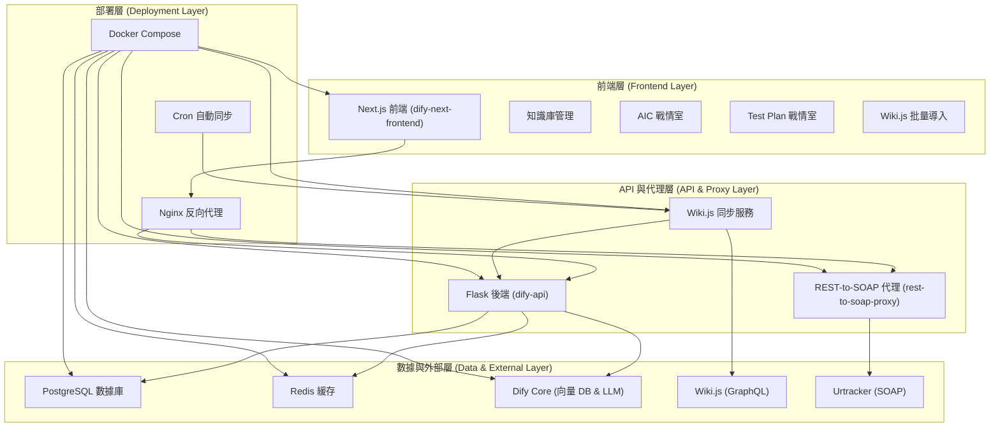

# Dify 自定義系統架構總結報告

## 項目概述
本項目是基於開源 Dify 平台的自定義實現，專為企業環境優化，整合了內部工具和自動化流程。與標準 Dify 相比，本版本強調企業集成、自動同步和專用儀表板，提供更高效的知識管理和項目監控體驗。代碼位於 `c:\Users\andycy.wu\dify`，支援 Docker 部署和微服務架構。

## 系統架構圖

### 架構說明
- **前端層**: Next.js 應用，提供用戶界面和 API 路由。
- **API 與代理層**: 處理業務邏輯和外部服務橋接。
- **數據與外部層**: 存儲數據並集成企業工具。
- **部署層**: Docker 容器化，支持自動化同步。

## 核心功能特點

### 1. 企業集成與自動化
- **Wiki.js 同步系統**: 增量同步文檔到知識庫，支持多部門 (10 個知識庫)，自動預處理和分段。與標準 Dify 不同，本版本添加了 Cron 自動同步 (`cron-runner.js`)，無需手動觸發。
- **Urtracker 集成**: 通過 REST-to-SOAP 代理訪問項目管理數據，提供 AIC 和 Test Plan 儀表板。標準 Dify 無此企業特定集成。
- **批量導入工具**: 支持 13 種文件格式批量上傳到 Wiki.js，包含 Web 界面和 CLI 工具。

### 2. 專用儀表板
- **AIC 戰情室**: 即時查詢 Urtracker 專案數據 (TV/PD/MNT/AVA)，支援篩選、下載 Excel 和分頁。標準 Dify 聚焦 LLM 應用，此版本添加項目監控功能。
- **Test Plan 戰情室**: 顯示測試計劃統計和 ODM 進度，實時更新數據。企業定制功能，無標準 Dify 等價物。

### 3. 知識庫增強
- **前處理系統**: 自動轉換文件為 Markdown，智能分段 (400-800 tokens)，錯誤容錯。標準 Dify 有基本處理，此版本支援更多格式並集成同步。
- **權限管理**: 基於角色的訪問 (admin/owner)，動態 UI。

### 4. 部署與可擴展性
- **Docker 化**: 多容器架構，支持 Nginx 代理和持久化卷。與標準 Dify 類似，但添加了代理和同步服務容器。
- **自動化腳本**: Cron 任務和 CLI 工具，簡化維護。

## 與標準 Dify 的差異比較

| 特點 | 標準 Dify | 本自定義版本 |
|------|-----------|-------------|
| **企業集成** | 無特定企業工具 | 集成 Wiki.js 和 Urtracker，支援 SOAP/GraphQL |
| **自動同步** | 手動或基本 webhook | Cron 自動增量同步，多部門支持 |
| **儀表板** | 通用 LLM 應用管理 | 專用項目監控 (AIC/Test Plan) |
| **文件處理** | 基本格式支持 | 13 種格式 + 智能分段 + 批量導入 |
| **部署** | 標準容器 | 添加代理服務和外部橋接 |
| **用戶體驗** | 通用開發者導向 | 企業用戶友好，響應式設計 |

## 技術棧
- **前端**: Next.js 13+, TypeScript, Tailwind CSS
- **後端**: Python Flask, SQLAlchemy
- **數據庫**: PostgreSQL, Redis
- **容器化**: Docker Compose, Nginx
- **外部**: Wiki.js (GraphQL), Urtracker (SOAP)
- **工具**: Node.js Cron, Axios

## 安裝與使用
1. 克隆倉庫: `git clone <repo-url>`
2. 安裝依賴: `npm install` (前端), `pip install` (後端)
3. 啟動 Docker: `docker-compose up`
4. 配置環境變數: 設置 API URL 和憑證
5. 運行同步: `node cron-runner.js`

## 貢獻與聯繫
歡迎 PR 和 Issue。聯繫: [andywu719@gmail.com]

此報告突出本項目的企業定制特點，使其在 GitHub 上脫穎而出。詳細文檔可在 `README.md` 中擴展。

## 許可證聲明
本項目基於 Dify Open Source License，並使用多個開源依賴。請參考各依賴的 LICENSE 文件。
